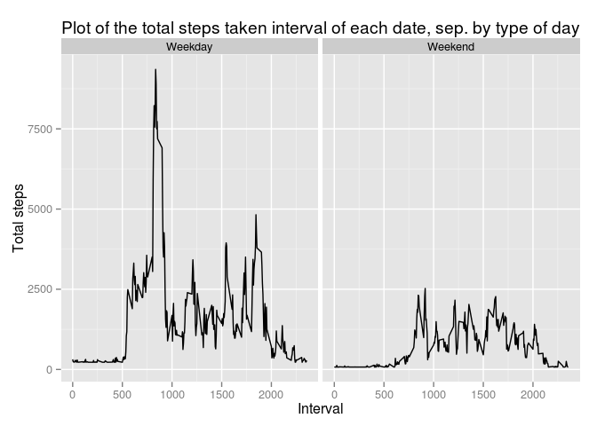

# Reproducible Research: Peer Assessment 1


## Loading and preprocessing the data


```r
library(ggplot2)
data <- read.csv("./data/activity.csv")
head(data)
```

```
##   steps       date interval
## 1    NA 2012-10-01        0
## 2    NA 2012-10-01        5
## 3    NA 2012-10-01       10
## 4    NA 2012-10-01       15
## 5    NA 2012-10-01       20
## 6    NA 2012-10-01       25
```

## What is mean total number of steps taken per day?

* Total of activity by day:


```r
total <- aggregate(steps ~ date, data = data, FUN=sum)
total
```

```
##          date steps
## 1  2012-10-02   126
## 2  2012-10-03 11352
## 3  2012-10-04 12116
## 4  2012-10-05 13294
## 5  2012-10-06 15420
## 6  2012-10-07 11015
## 7  2012-10-09 12811
## 8  2012-10-10  9900
## 9  2012-10-11 10304
## 10 2012-10-12 17382
## 11 2012-10-13 12426
## 12 2012-10-14 15098
## 13 2012-10-15 10139
## 14 2012-10-16 15084
## 15 2012-10-17 13452
## 16 2012-10-18 10056
## 17 2012-10-19 11829
## 18 2012-10-20 10395
## 19 2012-10-21  8821
## 20 2012-10-22 13460
## 21 2012-10-23  8918
## 22 2012-10-24  8355
## 23 2012-10-25  2492
## 24 2012-10-26  6778
## 25 2012-10-27 10119
## 26 2012-10-28 11458
## 27 2012-10-29  5018
## 28 2012-10-30  9819
## 29 2012-10-31 15414
## 30 2012-11-02 10600
## 31 2012-11-03 10571
## 32 2012-11-05 10439
## 33 2012-11-06  8334
## 34 2012-11-07 12883
## 35 2012-11-08  3219
## 36 2012-11-11 12608
## 37 2012-11-12 10765
## 38 2012-11-13  7336
## 39 2012-11-15    41
## 40 2012-11-16  5441
## 41 2012-11-17 14339
## 42 2012-11-18 15110
## 43 2012-11-19  8841
## 44 2012-11-20  4472
## 45 2012-11-21 12787
## 46 2012-11-22 20427
## 47 2012-11-23 21194
## 48 2012-11-24 14478
## 49 2012-11-25 11834
## 50 2012-11-26 11162
## 51 2012-11-27 13646
## 52 2012-11-28 10183
## 53 2012-11-29  7047
```


```r
ggplot(total, aes(x=steps)) + 
  geom_histogram(binwidth=1000) + labs(title = "Histogram of the total number of steps taken each day", x="Steps", y="Frequency")
```

 


* Median

```r
median(total$steps)
```

```
## [1] 10765
```

* Mean

```r
mean(total$steps)
```

```
## [1] 10766.19
```

## What is the average daily activity pattern?


```r
totalInterval <- aggregate(steps ~ interval, data = data, FUN=sum)
ggplot(totalInterval, aes(x=interval, y=steps)) + geom_line() + labs(title = "Plot of the total steps taken interval of each date", x="Interval", y="Total steps")
```

 

* Best 5 minute interval:


```r
idx <- which(totalInterval$steps == max(totalInterval$steps))
totalInterval$interval[idx]
```

```
## [1] 835
```

## Imputing missing values

* Total of missings:


```r
nrow(data[is.na(data), ])
```

```
## [1] 2304
```

* Imput missing values by mean:


```r
columns = c('steps', 'interval')
for(column in columns){
  data[is.na(data[,column]), column] <- mean(data[,column], na.rm = TRUE)
}

nrow(data[is.na(data), ])
```

```
## [1] 0
```


```r
total <- aggregate(steps ~ date, data = data, FUN=sum)
ggplot(total, aes(x=steps)) + 
  geom_histogram(binwidth=1000) + labs(title = "Histogram of the total number of steps taken each day whithout NA", x="Steps", y="Frequency")
```

 

* Median

```r
median(total$steps)
```

```
## [1] 10766.19
```

* Mean

```r
mean(total$steps)
```

```
## [1] 10766.19
```

## Are there differences in activity patterns between weekdays and weekends?

* Creating a new variable with type of day: 

```r
data$daytype <- ifelse(as.POSIXlt(data$date)$wday %in% c(6,0), 'Weekend', 'Weekday')
```


```r
totalInterval <- aggregate(steps ~ interval * daytype, data = data, FUN=sum)
ggplot(totalInterval, aes(x=interval, y=steps)) + geom_line() + facet_wrap(~ daytype) + labs(title = "Plot of the total steps taken interval of each date, sep. by type of day", x="Interval", y="Total steps")
```

 

Note that the interval between 800 and 1000 of weekday is much more intense compared by weekend.
